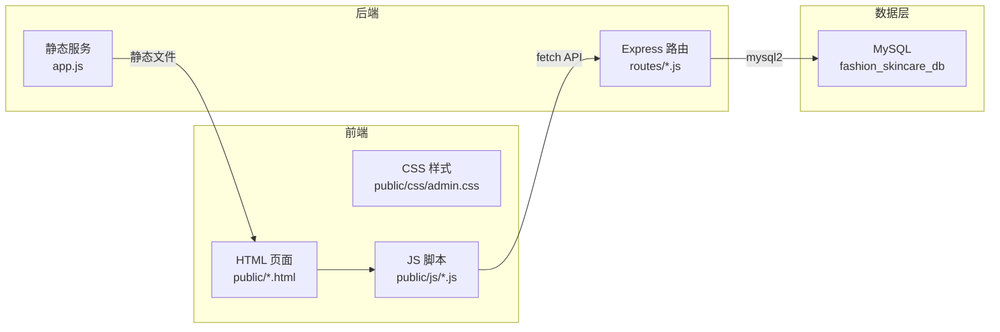

# 美丽推荐平台后台管理系统 - 技术架构文档

## 1. 架构设计



## 2. 技术选型说明

- **前端**：原生 HTML5 + CSS3 + JavaScript（无构建步骤，便于3人团队协作与课程演示）
- **后端**：Express 5.x（已存在，保留）
- **数据库**：MySQL（mysql2 驱动，已存在）
- **静态资源**：Express 静态服务 `/public` 目录
- **选择理由**：课程项目需要简单可读、易于修改的代码结构，原生三件套最符合"评优现场修改"的场景需求

## 3. 目录结构

```
beauty/
├── public/                      # 前端静态资源（Express 直接服务）
│   ├── index.html               # 工作台首页
│   ├── login.html               # 登录页
│   ├── user.html                # 用户管理
│   ├── photo.html               # 照片管理 CRUD
│   ├── analysis.html            # 分析结果查询（复杂查询1）
│   ├── style-rank.html          # 风格匹配排行（复杂查询4）
│   ├── recommend.html           # 推荐记录管理 CRUD
│   ├── recommend-detail.html    # 推荐详情查询（复杂查询2）
│   ├── skincare.html            # 护肤品管理 CRUD
│   ├── bundle-detail.html       # 套装详情查询（复杂查询3）
│   ├── style.html               # 风格标签管理 CRUD
│   ├── admin.html               # 管理员管理 CRUD
│   ├── log.html                 # 操作日志统计（复杂查询5）
│   ├── exercise.html            # 运动计划管理 CRUD
│   ├── css/
│   │   └── admin.css            # 全局样式
│   └── js/
│       ├── common.js            # 通用工具（侧边栏、fetch封装、分页）
│       ├── photo.js             # 照片管理逻辑
│       ├── recommend.js         # 推荐管理逻辑
│       ├── skincare.js          # 护肤品管理逻辑
│       └── ...                  # 各页面独立逻辑
├── routes/                      # 后端路由（已存在 userRouter.js）
│   ├── userRouter.js            # 用户相关路由
│   ├── photoRouter.js           # 照片路由（待实现）
│   └── ...
├── db/
│   └── config.js                # 数据库配置（已存在）
└── app.js                       # Express 入口（已存在）
```

## 4. 路由定义

| 页面路由 | 页面用途 |
|----------|----------|
| /login.html | 管理员登录 |
| /index.html | 工作台首页 |
| /photo.html | 照片管理 CRUD |
| /analysis.html | 分析结果查询 |
| /style-rank.html | 风格匹配排行 |
| /recommend.html | 推荐记录管理 CRUD |
| /recommend-detail.html | 推荐详情查询 |
| /skincare.html | 护肤品管理 CRUD |
| /bundle-detail.html | 套装详情查询 |
| /style.html | 风格标签管理 CRUD |
| /admin.html | 管理员管理 CRUD |
| /log.html | 操作日志统计 |
| /exercise.html | 运动计划管理 CRUD |
| /user.html | 用户管理 |

## 5. API 定义（前端调用接口）

### 5.1 照片管理 API

| 接口 | 方法 | 说明 |
|------|------|------|
| /photo/page | GET | 分页查询照片 |
| /photo/add | POST | 新增照片 |
| /photo/update | POST | 修改照片 |
| /photo/delete | POST | 删除照片 |

### 5.2 推荐管理 API

| 接口 | 方法 | 说明 |
|------|------|------|
| /recommend/page | GET | 分页查询推荐 |
| /recommend/add | POST | 新增推荐 |
| /recommend/update | POST | 修改推荐（含评分） |
| /recommend/delete | POST | 删除推荐 |
| /recommend/detail | GET | 推荐详情（多表联查） |

### 5.3 护肤品管理 API

| 接口 | 方法 | 说明 |
|------|------|------|
| /skincare/page | GET | 分页查询（支持品牌+价格+肤质多条件） |
| /skincare/add | POST | 新增产品 |
| /skincare/update | POST | 修改产品 |
| /skincare/delete | POST | 删除产品 |
| /bundle/detail | GET | 套装详情（多表联查） |

### 5.4 风格管理 API

| 接口 | 方法 | 说明 |
|------|------|------|
| /style/list | GET | 查询风格列表 |
| /style/add | POST | 新增风格 |
| /style/update | POST | 修改风格 |
| /style/delete | POST | 删除风格 |

### 5.5 系统管理 API

| 接口 | 方法 | 说明 |
|------|------|------|
| /admin/page | GET | 分页查询管理员 |
| /admin/add | POST | 新增管理员 |
| /admin/update | POST | 修改管理员 |
| /admin/delete | POST | 删除管理员 |
| /log/stats | GET | 操作日志统计（多表联查） |

### 5.6 复杂查询 API

| 接口 | 方法 | 说明 |
|------|------|------|
| /analysis/list | GET | 用户照片分析查询（User+Photo+AnalysisResult） |
| /style/rank | GET | 风格匹配排行（AnalysisResult+StyleMatch） |

## 6. 数据模型

### 6.1 核心表关系

```mermaid
erDiagram
    User ||--o{ Photo : "上传"
    User ||--o{ AnalysisResult : "分析"
    User ||--o{ Recommendation : "推荐"
    Photo ||--o{ AnalysisResult : "产生"
    AnalysisResult ||--o{ StyleMatch : "匹配"
    Style ||--o{ StyleMatch : "属于"
    AnalysisResult ||--o{ Recommendation : "触发"
    SkincareProduct ||--o{ BundleItem : "包含"
    ProductBundle ||--o{ BundleItem : "组成"
    Admin ||--o{ Log : "操作"
```

### 6.2 关键表字段（基于已有数据库 fashion_skincare_db）

- **Photo**：PhotoID, UserID, ImageURL, UploadTime, Status
- **AnalysisResult**：AnalysisID, PhotoID, UserID, SkinTone, FaceShape, AnalysisTime
- **Style**：StyleID, StyleName, Description
- **StyleMatch**：MatchID, AnalysisID, StyleID, MatchScore
- **Recommendation**：RecommendID, UserID, AnalysisID, RecommendType, RecommendReason, Status, RecommendScore(评优新增), RecommendTime
- **SkincareProduct**：ProductID, ProductName, Brand, Effect, Price, SkinType
- **ProductBundle**：BundleID, BundleName, Description, TotalPrice
- **BundleItem**：ItemID, BundleID, ProductID, Quantity
- **Admin**：AdminID, AdminName, AdminAccount, AdminPassword, Role
- **Log**：LogID, AdminID, Operation, OperateTime, IPAddress

## 7. 前端通用设计

### 7.1 通用布局组件

所有内页共享统一布局：
- **侧边栏**（220px 固定）：Logo + 菜单树（可折叠分组）
- **顶部栏**（60px）：面包屑 + 管理员信息 + 退出
- **内容区**：页面标题 + 搜索栏 + 操作按钮 + 数据表格 + 分页

### 7.2 通用 JS 工具（common.js）

- `fetchAPI(url, params)`：封装 fetch 请求
- `renderPagination(total, current, callback)`：渲染分页器
- `showModal(title, formHTML)`：显示模态框
- `confirmDelete(callback)`：删除确认
- `initSidebar(activeMenu)`：初始化侧边栏高亮
- `formatDate(timestamp)`：日期格式化

### 7.3 通用样式（admin.css）

- CSS 变量定义主题色
- 侧边栏、顶部栏、卡片、表格、按钮、表单、分页、模态框、提示框
- 响应式适配（min-width: 1024px）
